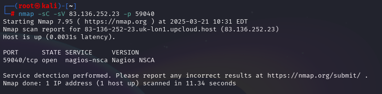

On check les deux IP > 


Le RPC indique une possible connexion via telnet à tester ensuite ..


Nous avons des instruction, testons en telnet : 


Bon ok, essayons le 3 : 


Il y a qqch à faire ::

Nous avons : 
- *Player Private Key* : La clé privée pour signer les transactions dans un réseau blockchain
- *Player Address* : L'adresse publique associée à la clé privée (elle reçoit les fonds/messages)
- *Target Contract* : Adresse du contrat intelligent, la cible (probablement)
- *Setup Contract* : Adresse de contrat pour configurer, initialiser qqch dans le réseau 


Essayons d'analyser le Port **44570**


gunicorn > 

Analysons le port **59040**


Sur internet on a des infos sur quoi faire avec du **BlockChain** : 


> [Blockchain Vulnerabilities in Etherium Solidity smart contracts | ZH3R0](https://medium.com/zh3r0/sharky-ctf-blockchain-level-0-to-4-writeup-524b728709d0)

Lets check Remix IDE avec la version Online :
https://remix-project.org/?lang=en


Mouai faut comprendre le WEB3 -- en fait on a des fichiers avec du code : 

un **contract** qui est **Eldorion.sol** 

```python
// SPDX-License-Identifier: MIT
pragma solidity ^0.8.28;

contract Eldorion {
    uint256 public health = 300;
    uint256 public lastAttackTimestamp;
    uint256 private constant MAX_HEALTH = 300;
    
    event EldorionDefeated(address slayer);
    
    modifier eternalResilience() {
        if (block.timestamp > lastAttackTimestamp) {
            health = MAX_HEALTH;
            lastAttackTimestamp = block.timestamp;
        }
        _;
    }
    
    function attack(uint256 damage) external eternalResilience {
        require(damage <= 100, "Mortals cannot strike harder than 100");
        require(health >= damage, "Overkill is wasteful");
        health -= damage;
        
        if (health == 0) {
            emit EldorionDefeated(msg.sender);
        }
    }

    function isDefeated() external view returns (bool) {
        return health == 0;
    }
}
```

Et de l'autre on à un **Setup.sol** : 
```python 
// SPDX-License-Identifier: MIT
pragma solidity ^0.8.28;

import { Eldorion } from "./Eldorion.sol";

contract Setup {
    Eldorion public immutable TARGET;
    
    event DeployedTarget(address at);

    constructor() payable {
        TARGET = new Eldorion();
        emit DeployedTarget(address(TARGET));
    }

    function isSolved() public view returns (bool) {
        return TARGET.isDefeated();
    }
}
```

Il a besoin du Eldorion.sol 

