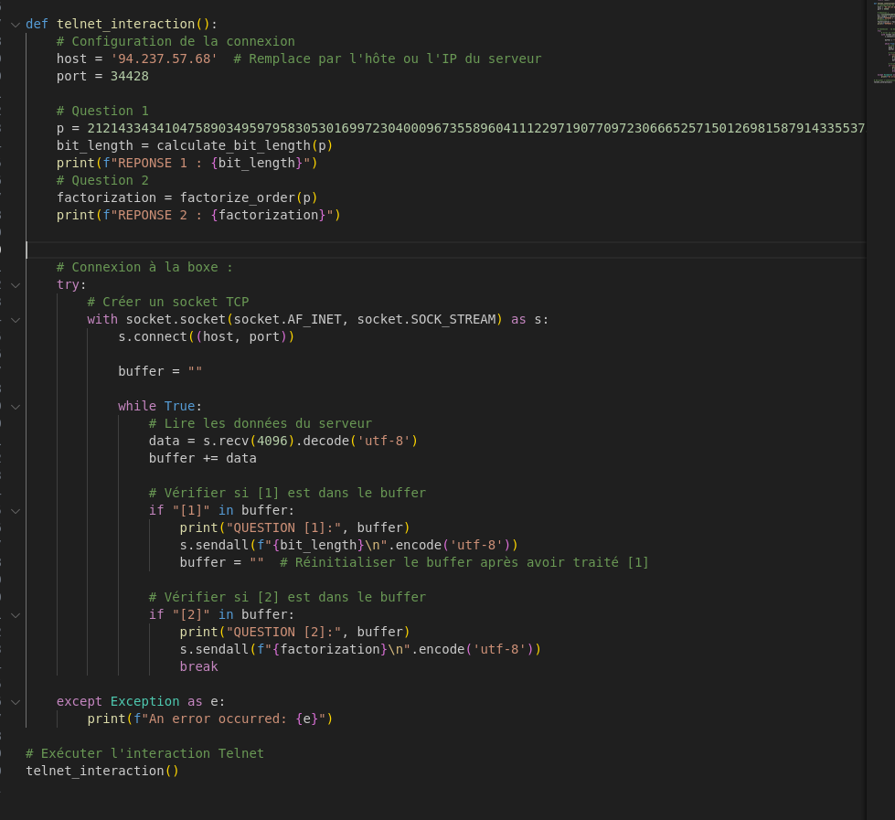
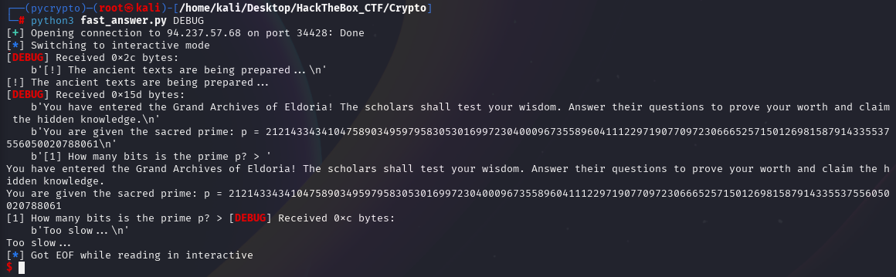
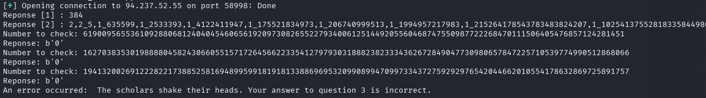

on se connect en telnet : mais pas assez de temps pour répondre

Il faut donc faire un script python pour guess la premiere question et répondre direct 




Lets try avec PWNTOOLS ::

On commence basique : 




Un script qui marche bien : 
```python
from pwn import *
import math
from sympy import gcd, factorint

def calculate_bit_length(number):
    return math.floor(math.log2(number)) + 1

def factorize_order(p):
    order = p - 1
    factors = factorint(order)
    sorted_factors = sorted(factors.items())
    result = '_'.join(f"{prime},{exponent}" for prime, exponent in sorted_factors)
    return result

def is_gdc(g, p):
    #--- Calcul gcd : 
    if gcd(g, p) != 1:
        return 1  # g n'est pas premier avec p, donc pas un generateur
    else: 
        return 0

def is_generator(g, p):
    if gcd(g, p) != 1:
        return 0
    factors = factorint(p-1)
    for q in factors:
        if pow(g, (p-1)//q, p) == 1:
            return 0
    return 1
    
def extract_number(text):
    # Utiliser une expression régulière pour extraire les chiffres
    match = re.search(r'\b\d+\b', text)
    if match:
        return match.group(0)
    return None

def main():
    # Configuration de la connexion
    host = '94.237.61.48'
    port = 51031

    p = 21214334341047589034959795830530169972304000967355896041112297190770972306665257150126981587914335537556050020788061
    factorization = "2,2_5,1_635599,1_2533393,1_4122411947,1_175521834973,1_206740999513,1_1994957217983,1_215264178543783483824207,1_10254137552818335844980930258636403,1"

    # Calculer la factorisation de l'ordre de p-1
    #factorization = factorize_order(p)

    # Connexion au serveur
    io = remote(host, port)

    try:
        # ----------
        # QUESTION 1
        # Lecture de la premiere question jusqua >
        io.recvuntil(b'> ')

        # Calculer le nombre de bits de p
        # bit_length = calculate_bit_length(p)
        bit_length = "384"

        # Envoyer la reponse a la question 1
        print("Reponse [1] :", bit_length)
        io.sendline(bit_length.encode('utf-8'))

        # ----------
        # QUESTION 2
        # Lire les donnees du serveur jusqu'a ce que '[2]' apparaisse (la deuxieme question)
        io.recvuntil(b'[2]')
        # Lire jusqu'au prompt '>' 
        io.recvuntil(b'> ')

        # Envoyer la reponse a la question 2
        print("Reponse [2] :", factorization)
        io.sendline(factorization.encode('utf-8'))

        # -----------
        # QUESTION 3 
        io.recvuntil(b'otherwise 0.\n')
        number_G = io.recvuntil(b'?')[:-1]
        print("Number to check:", number_G.decode('utf-8'))
        number_G = int(number_G.decode('utf-8'))
        answer = is_gdc(number_G, p)

        answer_bytes = str(answer).encode('utf-8')

        print("Reponse:", answer_bytes)
        io.sendline(answer_bytes)

        # Boucle sur les autres nombre :
        while True:
            io.recvuntil(b'> ')

            number_G = io.recvuntil(b'?')[:-1]
            print("Number to check:", number_G.decode('utf-8'))

            number_G = int(number_G.decode('utf-8'))
            answer = is_gdc(number_G, p)

            answer_bytes = str(answer).encode('utf-8')

            print("Reponse:", answer_bytes)
            io.sendline(answer_bytes)

        # Garder la session interactive ouverte
        io.interactive()

        
    except Exception as e:
        line = io.recvline()
        print(f"An error occurred: {e}", line.decode('utf-8'))

    finally:
        io.close()

# Execution du script
main()


```

Reprennons les questions : 

Question [1]

> Answer : 384

Question [2]

> Answer `def factorize_order(p): `

Question [3] 


> Probleme fonction trop longue... je ne vois pas comment faire ^^'...

Et même si je prend juste la fonction **gcd()** a un moment j'ai faux : 


==Attente de WRITE UP==
