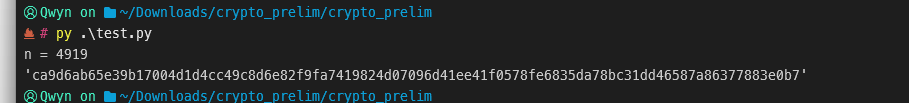
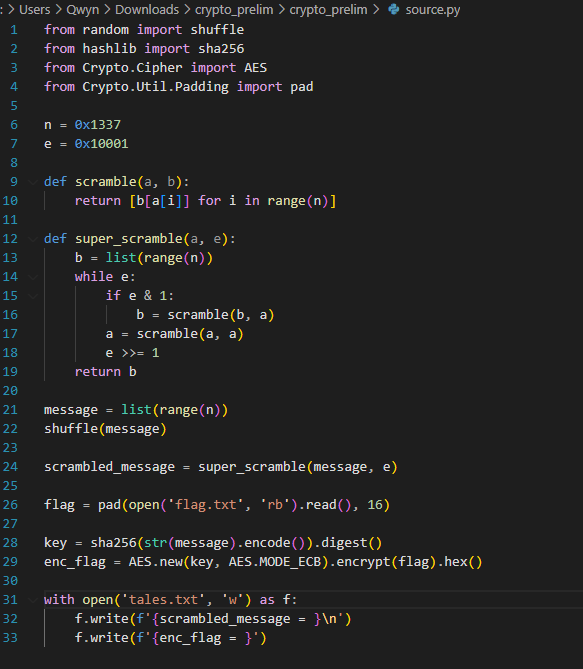

Fichier texte avec : 
un scrambled message et un enc_flag : 



il faut réussir a **undo** le tout : 

On reprend le fichier **tales.txt** et on lis ligne à ligne : 

```python
# Lire les valeurs depuis le fichier
with open('tales.txt', 'r') as f:
    lines = f.readlines()

scrambled_message_line = lines[0].split('=')[1].strip()
enc_flag_line = lines[1].split('=')[1].strip()
```

Ensuite on va **unscramble** : 

```python
# Fonction de unscramble
def unscramble(b, a):
    return [a.index(b[i]) for i in range(len(a))]
```

Super unscramble : 

```python
# Fonction de super_unscramble
def super_unscramble(b, e):
    a = list(range(len(b)))
    while e:
        if e & 1:
            b = unscramble(b, a)
        a = unscramble(a, a)
        e >>= 1
    return b
```

On a aussi nos deux valeurs 
`n = 0x1337`
`e = 0x10001`


**n** : est en *hexadecimal* qui est égale à **4919**, il représente la taille de la liste sur lequel les opération de brouillage (**scramble**) sont effectuées. 
Dans le code, n permet de définir la plage des **indices** de la liste **range(n)** 

**e** : est en *hexadecimal* qui est égale à **65537**, utilisé comme un exposant dans le processus de brouillage. Il détermine combien de fois l'opération de **scramble** est appliquée. 
L'opération est appliquée **Bit à Bit** dans une boucle pour déterminer quand appliquer l'opération 

---
AID ECHAT GPT : 

Le but ici est d'inverser le processus pour récupérer le flag déchiffré à partir des données contenues dans `tales.txt`.
### Analyse du chiffrement :

1. **Permutation :**
    
    - `message` est une liste de `n = 0x1337` éléments mélangés.
        
    - `super_scramble(message, e)` applique une permutation déterminée par `e = 0x10001`.
        
    - Le résultat est `scrambled_message`.
        
2. **Clé AES :**
    
    - La clé est dérivée du `message` d'origine via `sha256(str(message).encode()).digest()`.
        
    - AES est utilisé en mode ECB pour chiffrer `flag.txt`.
        

### Objectif :

- **Retrouver `message` à partir de `scrambled_message`** en inversant `super_scramble`.
    
- **Recalculer la clé** avec `message`.
    
- **Déchiffrer `enc_flag`** pour récupérer le flag.

Ni chatGPT ni LeChat ont réussi :D

