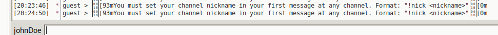

On est sur le server : 

Dans les fichiers on a des indices sur le fait que c'est un chat IRC : 

Pour se connecter dessus, je vais utiliser l'outil : **HexChat** 

Je le configure mais cela ne fonctionne pas for now 

Ok faut juste prendre l'IP données : 
Mettre a jour le /etc/hosts maybe ?

Puis changer le port sur le **HexChat**

avec **/list** on a la liste des channels : 

Mais le channel secret need une clé  'normal' :D

Je join le channel General : 

Hum > Avec **Hash-identifier** > il me dit que c'est du MD5

Lest find out sur **hashcat** 

Nothing, :: 

Toujours impossible de mettre un !nickname

---

On peut lister les **membres**

On decrypt en refaisant le cryptage !

Donc si on poste le message crypter alors on aura le message décrypté en clair 

Mais ce putain de chan IRC me casse les couilles avec son **!nick** !!!!!!!!!!!!!

.... je ne vois pas :'()....
