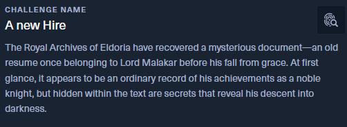

nmap : 
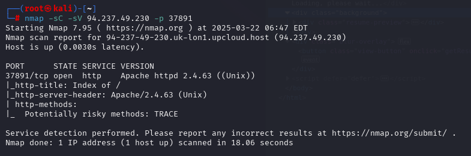

web : 
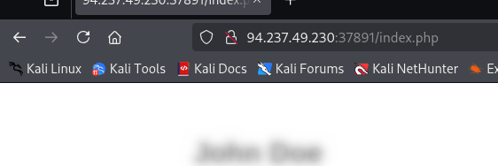

lets try to DL : index.php 
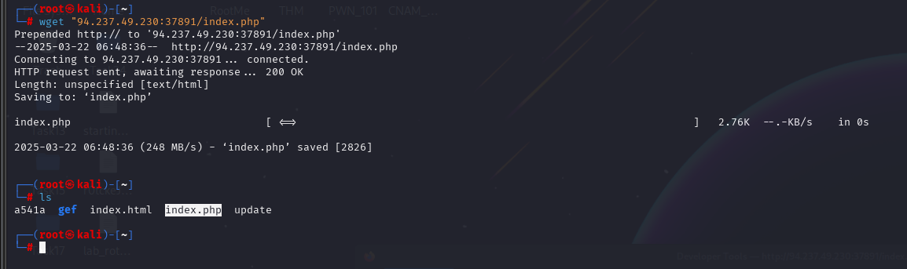

On remarque un truc sympa en bas : 

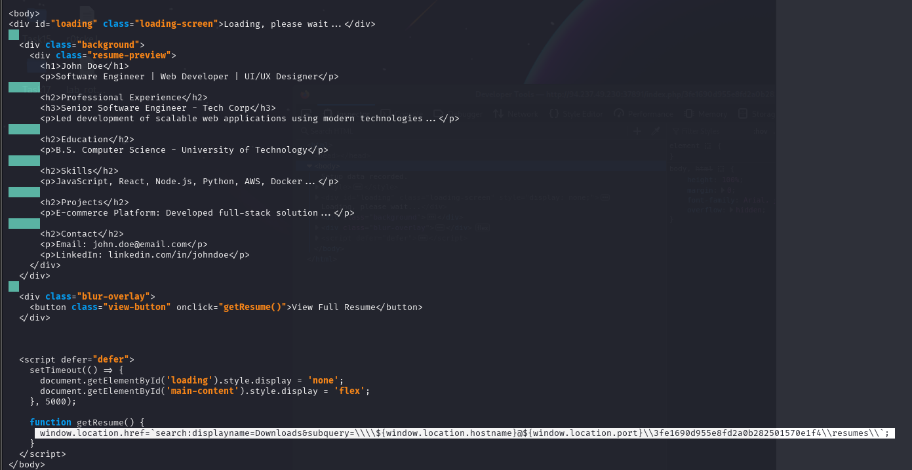
 search:displayname=Downloads&subquery=
 ```python
${window.location.hostname}@${window.location.port}\\3fe1690d955e8fd2a0b282501570e1f4\\resumes\\
```

Essayons de DL ce fichier : 

`wget 94.237.49.230:37891/3fe1690d955e8fd2a0b282501570e1f4/resumes`

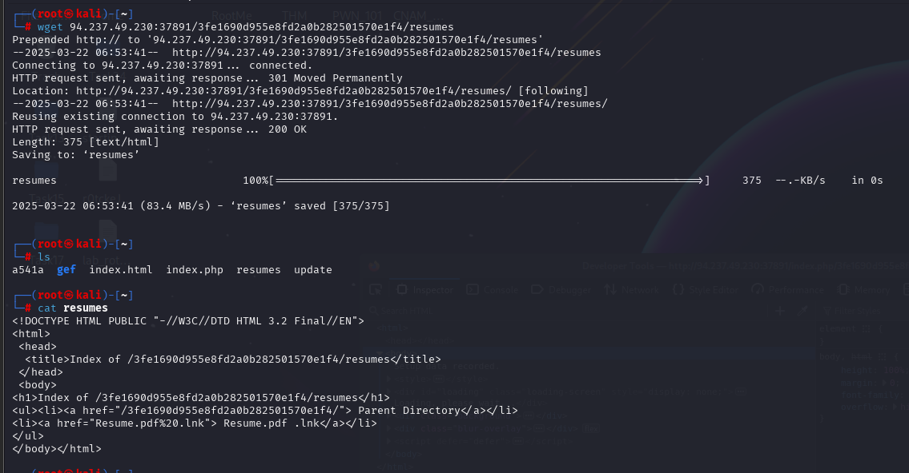

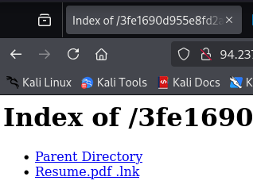


On vois un PDF lets DL it : **Nothing.. fausse route** 
On remonte le parent Directory et on trouve : **resumesS**

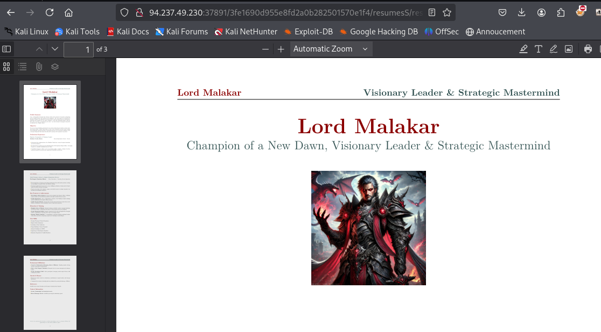

Stegano sur **PDF** : 

file : 
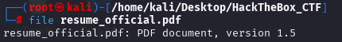

strings : 
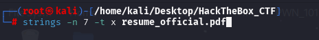
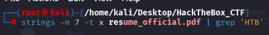

exiftools : 
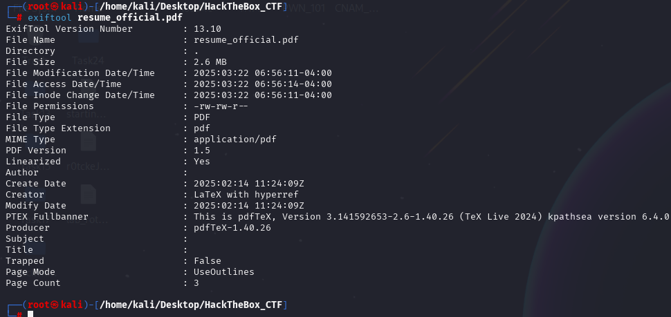

ZIP file hidden ? 
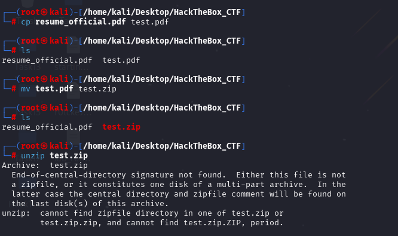
NON...

Binwalk : 
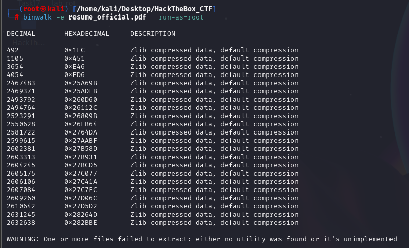

J'ai DL l'image du baron : >

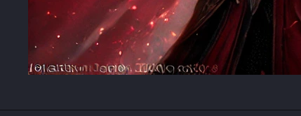

Ya un truc >> faut lire ça : 
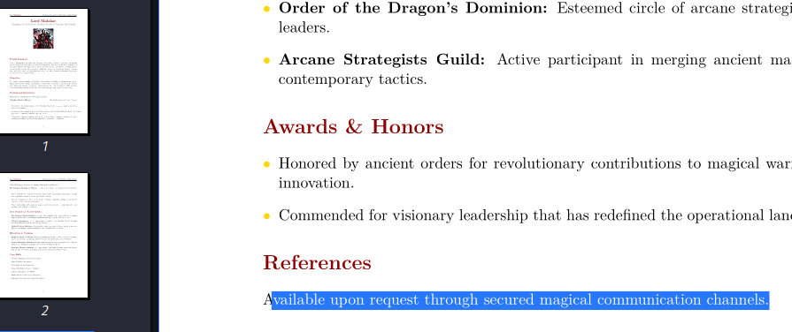

Ce qui me fait revenir sur le site et.. Juste à aller dans **/configs/client.py**
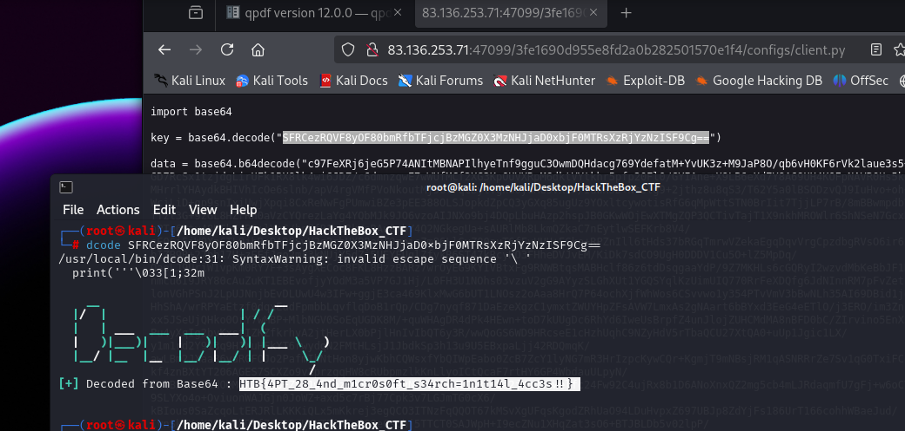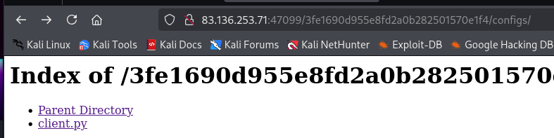

